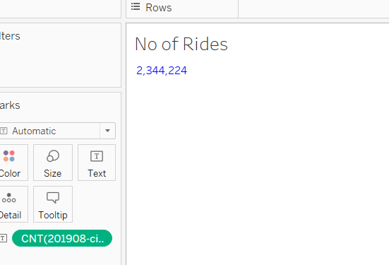
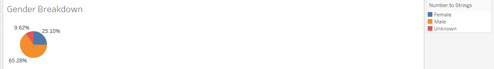
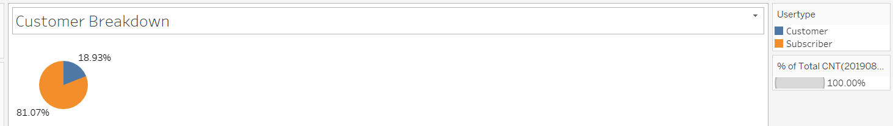
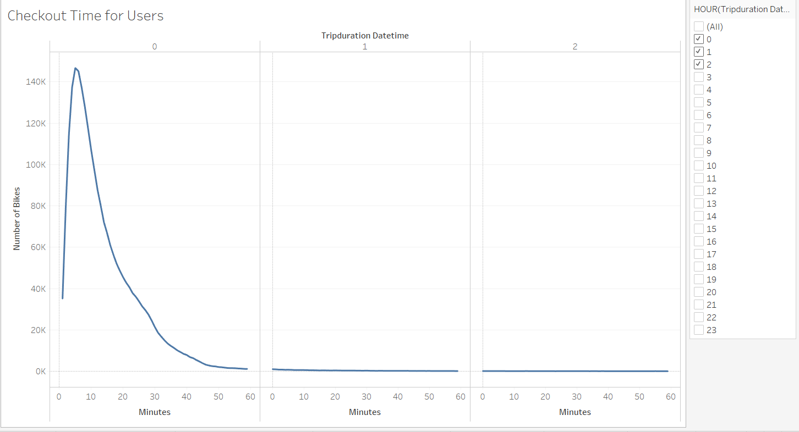
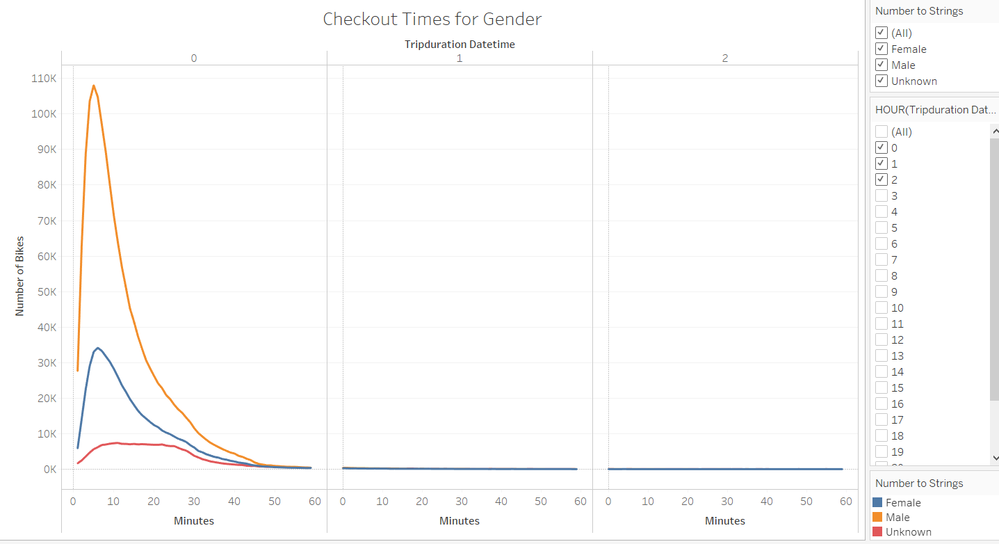
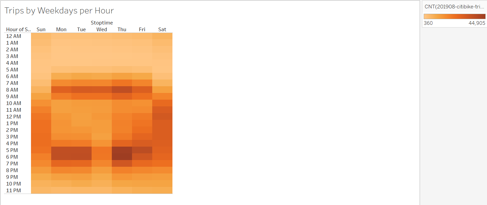
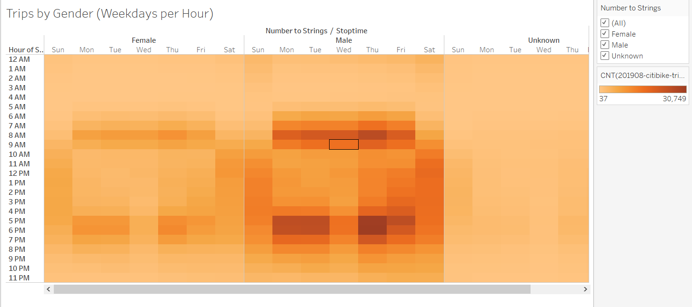
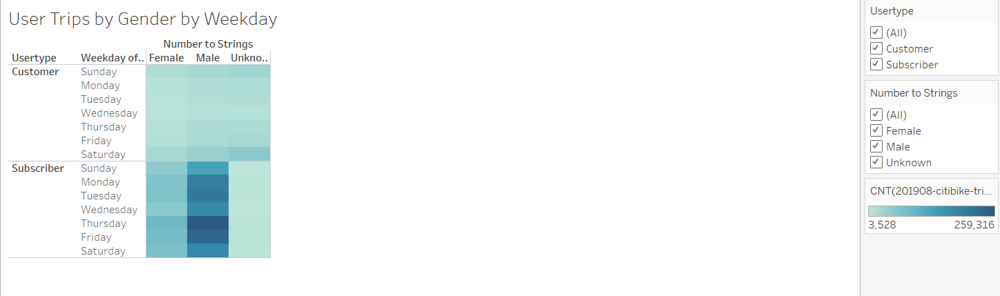
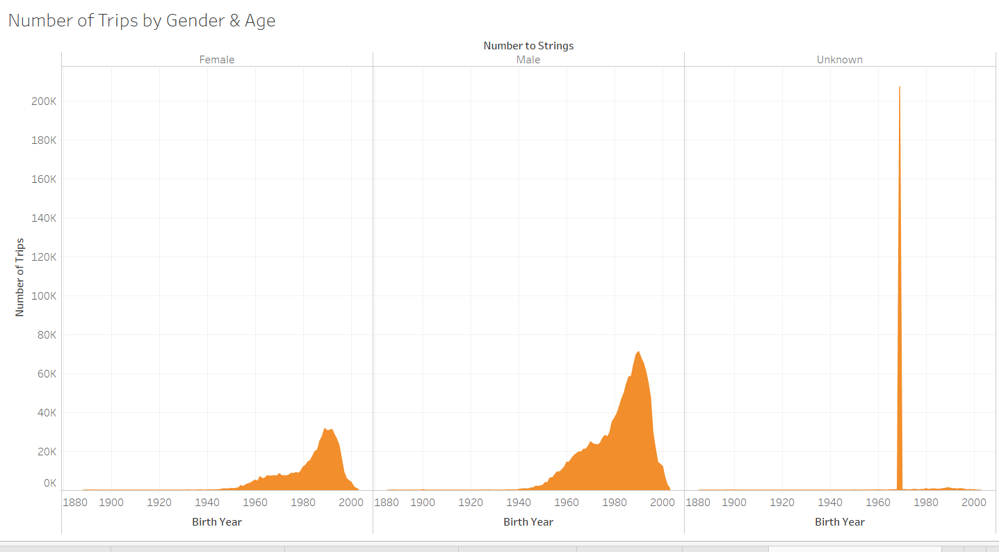
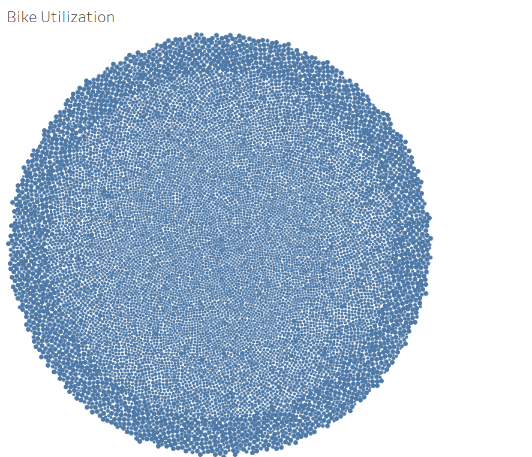

# **PROJECT OVERVIEW**
This project is about the study and analysis of *Bikesharing* business in the city of New York so that a similar business can be pitched to the investors for the city of Des Moines. In this study, we would analyze the data for the bike usage for the month of August 2019 and inspect it from different angles to understand the depth of the business. The data would be analyzed and presented with the help of Tableau.

# **RESULTS**

The data has been analyzed and would be explained through the following visuals.

## **1- Number of Rides**

The total number of rides in this dataset (Aug 2019) are 2,344,224. This include all the rides by genders and type of customers.

## **2- Gender Breakdown**

Out of the total rides, there are 1,530,272 (65.28%) rides by Males, 588,431 (25.10%) by Females and 225,521 (9.62%) gender is unknown. 

## **3- Customer Breakdown**

There are two types of users of these bikes. One who are the *subscribers* (regular users) and the other are *customers* who use the bikes for once (they could be tourists as well). Our data shows that 81% are the Subscribers and 19% are customers.

## **4- Checkout Time for Users**

This visualization shows the length of time these bikes are checked out for all the users. This graph tells us that most of the bikes are checked out for a duration of under 20 minutes and there is no usage of bikes for over 50 minutes of time.

## **5-Checkout Time for Gender**

This visualization shows the length of time the bikes are checked out by each gender. This is in line with the previous graph which shows that maximum checout time is under 20 minutes and no bike is used for over 50 minutes.

## **6-Trips by Weekday per Hour**

This visualization has been shown in the form of heatmap and tells us the busiest hours of the day and the busiest days of the week. It is clear from this heatmap that from 7-9 AM and 5-7 PM of the weekdays are the most busiest whereas Saturdays are busiest from 10 Am to 7PM and Sundays are busy during the hours of 11 Am to 5PM.

## **7- Trips by Gender (Weekday per Hour)**

This is again displayed by the heatmap and is separated by each Gender and shows the hours of the day and days of the week when bikes are most in use. The trend is in line with the previous graph and shows the busiest hours of the day.

## **8- User Trips by Gender by Weekdays**

This graph illustrates the bikes used by each kind of User (Customer and Subscriber) for each day of the week and shown separately for each Gender. We learn from this graph that the bikes are heavily used during the week days by the subscribers and usage by the customers is almost the same for the whole week.

## **9- Number of Trips by Gender & Age**

This visualization tells us the story of number of trips by each Gender along with their year of Birth. We learn from this graph that people born around 1990 whether Male or Female are the one who made the maximum trips. 

In this graph there is an unexplainable spike of number of trips by the people born in 1969 and we are not sure about their Gender. This needs to be further investigated but the good thing is that these number of trips are not significant as compared to total number of trips so we can rely on the rest of the data.

## **10- Bike Utilization**

This graph is important from the point of view of bike utilization since the maintenance of the bikes would be one of the major operational and cost component of the new business. We can see and identify the relevant bike ID from the size of the bubble to determine their usage and hence the maintenance. 

# **SUMMARY**

If we summarize the results of above data analysis, we can say that the bikes were mainly used by Males and they were using the bikes during the weekdays which probably mean that they were using the bikes to commute for the work (peak hours of usage reveals this). This makes sense for a city like New York and its down town where it is difficult to move around in cars or public transport and bikes are the best way to travel for the short distance (Majority of the rides are under 20 minutes) 

To pitch this business for a city like Des Moines which has much less population comparing New York, we need to further analyze the business model and following analysis would help us making the right pitch:

* Number of Trips by Gender and their age has already been presented above which tells us the users for this business.

* An analysis of age breakdown of the Subscribers and the customers would further highlight the dynamics of the target market.

* Comparison of population and number of tourists of New York and Des Moines to see how many bikes would be needed to estimate the initial cost. This woiuld help in determining the feasibility of the business.
* What are the distances and destinations in Des Moines which can be covered by the bikes in under 20 minutes (Since that is the time the bikes are mostly used for) and people would prefer to use bikes over other transport.

# **LINK TO TABLEAU-PUBLIC**

[link to dashboard](https://public.tableau.com/views/Bikesharing_challenge_16123931480660/CitibikeProject?:language=en&:display_count=y&publish=yes&:origin=viz_share_link)
